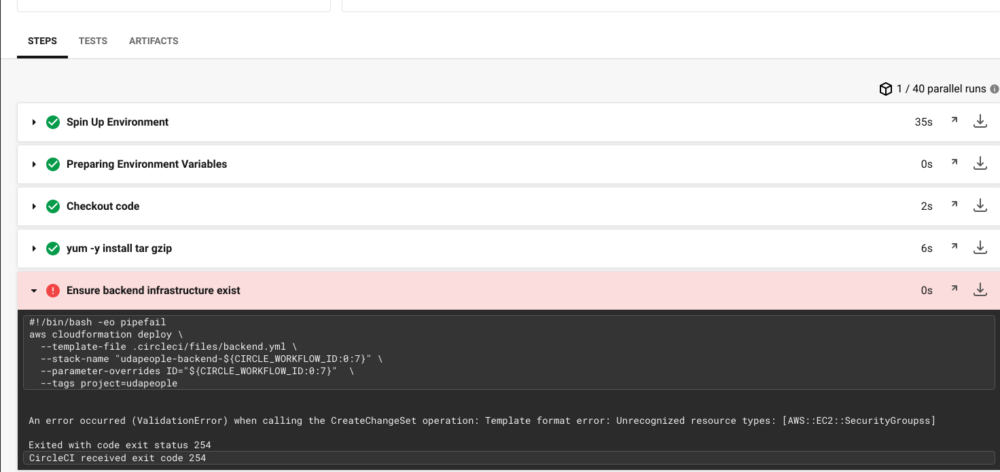
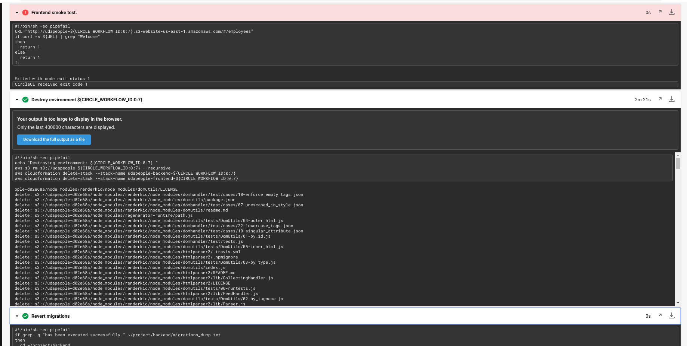
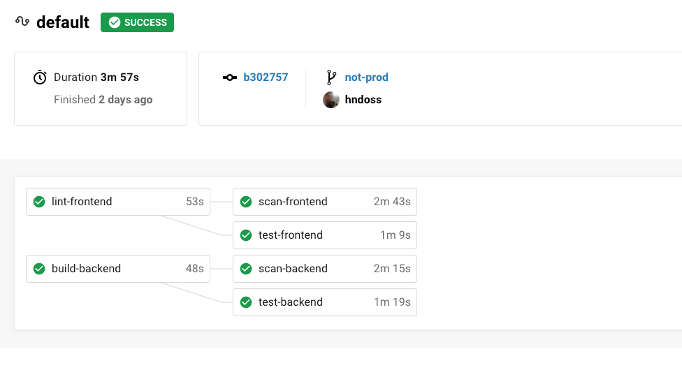

## Section 3 - Utilize a Configuration Management Tool to Accomplish Deployment to Cloud-Based Servers

### Setup

#### AWS
1. Create and download a new key pair in AWS for CircleCI to use to work with AWS resources. [This tutorial may help](https://docs.aws.amazon.com/AWSEC2/latest/UserGuide/ec2-key-pairs.html#having-ec2-create-your-key-pair) (Option 1: Create a key pair using Amazon EC2). You'll be using this key pair (pem file) in future steps so name it well and keep it in a memorable location. 
2. Create IAM user for programmatic access only and copy the id and access keys. [This tutorial may help.](https://serverless-stack.com/chapters/create-an-iam-user.html) You'll need these keys if you want to try any AWS commands from your own command line. You'll also need these credentialsto add to Circle CI configuration in the next steps.
3. Add a PostgreSQL database in RDS that has **public accessibility**. Take note of the connection details (hostname, username, password). [This tutorial may help.](https://aws.amazon.com/getting-started/tutorials/create-connect-postgresql-db/) As long as you marked "Public Accessibility" as "yes", you won't need to worry about VPC settings or security groups.

#### Circle CI

1. Add SSH Key pair from EC2 as shown [here](https://circleci.com/docs/2.0/add-ssh-key/). To get the actual key pair, you'll need to open the pem file in a text editor and copy the contents. Then you can paste them into Circle CI.

2. Add the following environment variables to your Circle CI project by navigating to {project name} > Settings > Environment Variables as shown [here](https://circleci.com/docs/2.0/settings/):
  - `AWS_ACCESS_KEY_ID`=(from IAM user with programmatic access)
  - `AWS_SECRET_ACCESS_KEY`= (from IAM user with programmatic access)
  - `TYPEORM_CONNECTION`=`postgres`
  - `TYPEORM_MIGRATIONS_DIR`=`./src/migrations`
  - `TYPEORM_ENTITIES`=`./src/modules/domain/**/*.entity.ts`
  - `TYPEORM_MIGRATIONS`=`./src/migrations/*.ts`
  - `TYPEORM_HOST`={your postgres database hostname in RDS}
  - `TYPEORM_PORT`=`5532` (or the port from RDS if it’s different)
  - `TYPEORM_USERNAME`={your postgres database username in RDS}
  - `TYPEORM_PASSWORD`={your postgres database password in RDS}
  - `TYPEORM_DATABASE`={your postgres database name in RDS}

### To Do

#### 1. Infrastructure Phase

Setting up servers and infrastructure is complicated business. There are many, many moving parts and points of failure. The opportunity for failure is massive when all that infrastructure is handled manually by human beings. Let’s face it. We’re pretty horrible at consistency. That’s why UdaPeople adopted the IaC (“Infrastructure as Code”) philosophy after “Developer Dave” got back from the last DevOps conference. We’ll need a job that executes some CloudFormation templates so that the UdaPeople team never has to worry about a missed deployment checklist item.



- Add jobs to your config file to create your infrastructure using [CloudFormation templates](https://github.com/udacity/cdond-c3-projectstarter/tree/master/.circleci/files). Again, provide a screenshot demonstrating an appropriate job failure (failing for the right reasons). **[SCREENSHOT05]**
  - Use the pipeline/workflow id to name, tag or otherwise mark your CloudFormation stacks so that you can reference them later on (ex: rollback). If you'd like, you can use the parameterized CloudFormation templates we provided. 
  - New EC2 Instance for back-end.
    - Make sure the EC2 instance has your back-end port opened up to public traffic (default port 3030).
  - Save the new back-end url for later use (the front-end needs it). This could be done with [MemStash.io](https://memstash.io).
  - New S3 Bucket for front-end.
  - Save the old bucket arn in case you need it later (for rollback). This could be done with [MemStash.io](https://memstash.io).
- Create an Ansible playbook to set up the backend server.
  - Install Python, if needed.
  - Update/upgrade packages.
  - Install nodejs.
  - Install pm2.
  - Configure environment variables:
    - `ENVIRONMENT`=`production`
    - `TYPEORM_CONNECTION`=`postgres`
    - `TYPEORM_ENTITIES`=`./src/modules/domain/**/*.entity.ts`
    - `TYPEORM_HOST`={your postgres database hostname in RDS}
    - `TYPEORM_PORT`=`5532` (or the port from RDS if it’s different)
    - `TYPEORM_USERNAME`={your postgres database username in RDS}
    - `TYPEORM_PASSWORD`={your postgres database password in RDS}
    - `TYPEORM_DATABASE`={your postgres database name in RDS}
  - [Configure PM2](https://www.digitalocean.com/community/tutorials/how-to-use-pm2-to-setup-a-node-js-production-environment-on-an-ubuntu-vps) to run back-end server .
- In the back-end deploy job, execute Ansible playbook to configure the instance.
- Provide a URL to your public GitHub repository. **[URL01]**
- Provide the public Url to working CI/CD pipeline **[URL02]**

#### 2. Deploy Phase

Now that the infrastructure is up and running, it’s time to configure for dependencies and move our application files over. UdaPeople used to have this ops guy in the other building to make the copy every Friday, but now they want to make a full deploy on every single commit. Luckily for UdaPeople, you’re about to add a job that handles this automatically using Ansible. The ops guy will finally have enough time to catch up on his Netflix playlist.

- Add a job that runs database migrations so that new changes are applied. 
  - Save some evidence that any new migrations ran. This is useful information if you need to rollback. To do this, you can use bash to save the migration output to a file or a variable. Then you can use grep to check for certain words that show that new migrations were run. It might help to use [MemStash.io](https://memstash.io) to store a true or false if any migrations were run (hint: use something like `<< pipeline.id >>_migrations` as a key).
- Add a job to build and copy the compiled back-end files to your new EC2 instance. Use Ansible to copy the files (compiled back-end files can be found in a folder called `./dist`).
- Add a job to prepare the front-end code for distribution and deploy it. 
  - Before building, add the back-end url that you saved earlier to the job's `API_URL` environment variables before running re-compiling the code. This will ensure the front-end is pointing to the correct back-end. 
  - Run `npm run build` one last time so that the back-end url gets "baked into" the front-end. 
  - Copy the files to your new S3 Bucket using AWS CLI (compiled front-end files can be found in a folder called `./dist`).
- Provide the public URL for your S3 Bucket (aka, your front-end). **[URL02]**

#### 3. Smoke Test Phase

All this automated deployment stuff is great, but what if there’s something we didn’t plan for that made it through to production? What if the UdaPeople website is now down due to a runtime bug that our unit tests didn’t catch? Users won’t be able to access their data! This same situation can happen with manual deployments, too. In a manual deployment situation, what’s the first thing you do after you finish deploying? You do a “smoke test” by going to the site and making sure you can still log in or navigate around. You might do a quick `curl` on the backend to make sure it is responding. In an automated scenario, you can do the same thing through code. Let’s add a job to provide the UdaPeople team with a little sanity check.


- Add a job to make a simple test on both front-end and back-end. Use the suggested tests below or come up with your own. 
  - Check `$API_URL/api/status` to make sure it returns a healthy response.
```bash
BACKEND_IP=$(aws ec2 describe-instances \
  --filters "Name=tag:Name,Values=backend-${CIRCLE_WORKFLOW_ID:0:7}" \
  --query 'Reservations[*].Instances[*].PublicIpAddress' \
  --output text)
curl "http://${BACKEND_IP}:3030/api/status"
```
  - Check the front-end to make sure it includes a word or two that proves it is working properly.
```bash
URL="http://udapeople-${CIRCLE_WORKFLOW_ID:0:7}.s3-website-us-east-1.amazonaws.com/#/employees"            
if curl -s ${URL} | grep "Welcome"
then
  return 1
else
  return 0
fi
```
- Provide a screenshot for appropriate failure for the smoke test job. **[SCREENSHOT06]**

#### 4. Rollback Phase

Of course, we all hope every pipeline follows the “happy path.” But any experienced UdaPeople developer knows that it’s not always the case. If the smoke test fails, what should we do? The smart thing would be to hit CTRL-Z and undo all our changes. But is it really that easy? It will be once you build the next job!



- Add a “[command](https://circleci.com/docs/2.0/reusing-config/#authoring-reusable-commands)” that rolls back the last change:
  - Only trigger rollback jobs if the smoke tests or any following jobs fail. 
  - Delete files uploaded to S3.
  - Destroy the current CloudFormation stacks using the same stack names you used when creating the stack earlier (front-end and back-end).
  - Revert the last migration (IF a new migration was applied) on the database to that it goes back to the way it was before. You can use that value you saved in [MemStash.io](https://memstash.io) to know if you should revert any migrations.
- No more jobs should run after this.
- Provide a screenshot for a successful rollback after a failed smoke test. **[SCREENSHOT07]**
- Try adding this rollback command to other jobs that might fail and need a rollback.

#### 5. Promotion Phase

Assuming the smoke test came back clean, we should have a relatively high level of confidence that our deployment was a 99% success. Now’s time for the last 1%. UdaPeople uses the “Blue-Green Deployment Strategy” which means we deployed a second environment or stack next to our existing production stack. Now that we’re sure everything is "A-okay", we can switch from blue to green. 


- Add a job that promotes our new front-end to production
  - Use a [CloudFormation template](https://github.com/udacity/cdond-c3-projectstarter/tree/master/.circleci/files) to change the origin of your CloudFront distribution to the new S3 bucket ARN.
- Provide a screenshot of the successful job. **[SCREENSHOT08]**
- Provide the public URL for your CloudFront distribution (aka, your production front-end). **[URL03]**
- Provide the public URL for your back-end server in EC2. **[URL04]**

#### 6. Cleanup Phase

The UdaPeople finance department likes it when your AWS bills are more or less the same as last month OR trending downward. But, what if all this “Blue-Green” is leaving behind a trail of dead-end production environments? That upward trend probably means no Christmas bonus for the dev team. Let’s make sure everyone at UdaPeople has a Merry Christmas by adding a job to clean up old stacks.


- Add a job that deletes the previous S3 bucket and EC2 instance. 
- Provide a screenshot of the successful job. **[SCREENSHOT09]**

#### Other Considerations

- Make sure you only run deployment-related jobs on commits to the `master` branch. Provide screenshot of a build triggered by a non-master commit. It should only run the jobs prior to deployment. **[SCREENSHOT10]**

